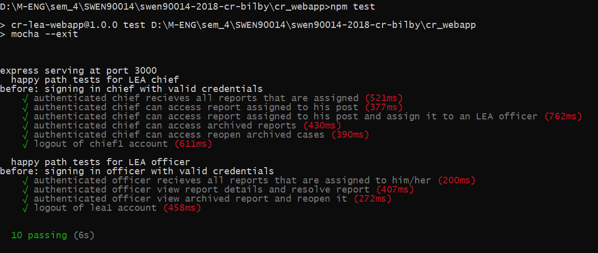

# Crime Reporting Web App
> CR_Bilby

A web app that allows law enforcement agents to manange reports filed from the app 

## Installing / Getting started

You will need to have nodeJS installed on your system to start. You can check if you have it installed with the following commands

```shell
node -v
```
 You can run the web app with the following command

 ```shell
npm install
npm start
```

The application will now be running on localhost:3000 or per your env config.


### Initial Configuration

sign in LEA Chief 1
username : chief1, password : 123456
sign in LEA Chief 2  
username : chief2, password : 123456

sign in LEA officer 1  
username : lea1, password : 123456
sign in LEA officer 2  
username : lea2, password : 123456

## Developing

Several functional aspects are still left unfinished:
- escalation
- administration
    - adding LEA officers
    - password recovery
    - changing LEA officer details
- system admin features
    - adding a post/police station
- searching/filtering reports 

Several non functional aspects are also unfinished:
- security
    - OAUTH 2.0 token is used
    - session cookie is not set to secure
    - session expiry not set
    - server is not https
- flash messages for confirmation/errors
- errors are not properly handled for:
    - officerController.resolve
    - LEAController.reopen
    - chiefController.assign

### Testing

To run the tests make sure that the values 'openReport' and 'closedReport'in "test/test.js" are set to values of report ids that:
    - openReport: is in chief1's dashboard and is unassigned.
    - closedReport: is in chief1's archive

You can check the id of a report by clicking on it and the subtitle will include the id.

The test is currently configured to work...however any additional tests will require you to change these values

You can run the tests after you have followed the steps in 'Installation/getting started' by running the following command

```shell
npm test
```

10 integration tests should be run testing:
- authentication for chief and all reports are successfully recieved
- chief can view report details
- chief can assign reports
- chief can view archived reports 
- chief can reopen archived cases
- chief can sign out

- authentication for officer and all reports recieved
- officer can view details of report and resolve a report
- officer can view archieved cases and reopen them
- officer can log out

Successful test should look like the below picture



## Features

The web app allows LEA chiefs to 
* view all cases in their juristiction
* view the details of these cases
* assign cases to LEA officers
* view archived/closed cases
* reopen closed cases

LEA officers to 
* view only cases assigned to them
* view the details of these cases
* resolve/close the case
* reopen the case

## Links

To find out more about this project's dependencies check the below links

- axios: https://www.npmjs.com/package/axios
- body-parser: https://www.npmjs.com/package/body-parser
- connect-flash: https://www.npmjs.com/package/connect-flash
- express: https://www.npmjs.com/package/express
- ejs: https://www.npmjs.com/package/ejs
- express-session: https://www.npmjs.com/package/express-session

Dev dependencies (testing)
- chai: https://www.npmjs.com/package/chai
- supertest: https://www.npmjs.com/package/supertest
- superagent: https://www.npmjs.com/package/superagent
- mocha: https://www.npmjs.com/package/mocha
